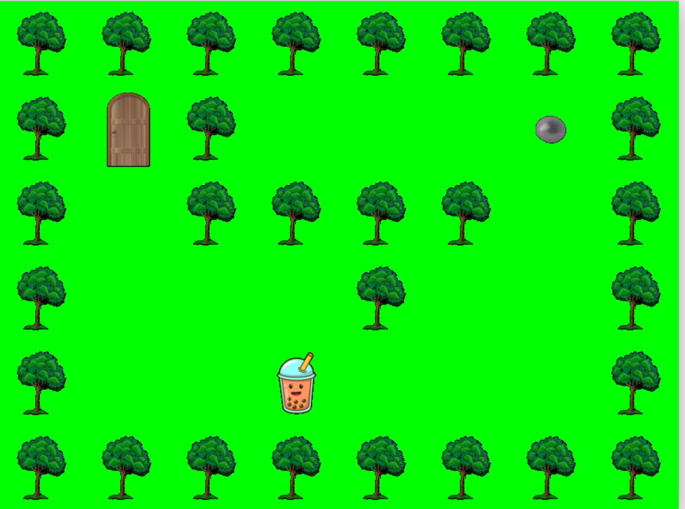

# So_long



## About the Project

**So_long** is a 2D boba game where the player must collect all the pearls (`C`) before reaching the exit (`E`) to complete the level.  
This is my first project in C that involves graphics, using the **MiniLibX (mlx) library** for rendering.  

The game map is represented as a grid with different elements:  
- `1` → Walls (Trees)  
- `P` → Player  
- `C` → Pearls (Collectibles)  
- `E` → Exit (Door)  
- `0` → Empty space (Walkable area)  

To ensure the map is valid, I implemented **Flood Fill Algorithm** for path validation.

---

## Flood Fill Algorithm for Map Validation

## What is the Flood Fill Algorithm?

The **Flood Fill Algorithm** is commonly used in computer graphics (e.g., the paint bucket tool in drawing applications) and pathfinding problems. It works by recursively exploring all reachable areas from a given starting position.

## How I Used Flood Fill for Map Validation

In **So_long**, I used the **Flood Fill Algorithm** to check if the player can reach all necessary elements (`C` pearls and `E` exit) without leaving the map boundaries.

## Implementation

## Checking Valid Positions
Before flooding, we check if a position is valid:
```c
static int	ft_is_flood_valid(char **map, int col, int row)
{
	if (map[col][row] == 'E' || map[col][row] == '0' || map[col][row] == 'C'
		|| map[col][row] == 'P')
		return (1);
	return (0);
}
```
Only P, C, E, and empty spaces (0) can be traversed.

## Recursive Flood Fill
The function recursively marks reachable positions (v for visited).

```c
char	**ft_flood_map(char **map, int col, int row)
{
	if (!ft_is_flood_valid(map, col, row))
		return (map);
	map[col][row] = 'v';
	if (ft_is_flood_valid(map, col + 1, row))
		ft_flood_map(map, col + 1, row);
	if (ft_is_flood_valid(map, col - 1, row))
		ft_flood_map(map, col - 1, row);
	if (ft_is_flood_valid(map, col, row + 1))
		ft_flood_map(map, col, row + 1);
	if (ft_is_flood_valid(map, col, row - 1))
		ft_flood_map(map, col, row - 1);
	return (map);
}
```
## Validating the Map
After applying flood fill, if any required element (P, C, or E) remains unvisited, the map is invalid.

```c
int	validate_flood(char **map, int col, int row)
{
	int	i;
	int	j;

	map = ft_flood_map(map, col, row);
	i = 0;
	j = 0;
	while (map[i])
	{
		while (map[i][j])
		{
			if (map[i][j] != '1' && map[i][j] != 'v' && map[i][j] != '\n')
				return (0);
			j++;
		}
		j = 0;
		i++;
	}
	return (1);
}
```
If all required elements are visited (v), the map is valid.


## Game Initialization

Before rendering the game, I determine the **window size** based on the map dimensions:

```c
void	get_window_size(char **map, int *height, int *width, t_data *data)
{
	*height = 0;
	*width = 0;
	while (map[*height])
		(*height)++;
	if (*height > 0)
	{
		*width = ft_strlen(map[0]);
		if (map[0][*width - 1] == '\n')
			(*width)--;
	}
	data->win_width = (*width) * IMAGE_SIZE;
	data->win_height = (*height) * IMAGE_SIZE;
}
```

This ensures that the game window correctly scales to fit the given map.

## Loading Game Assets
To display the game, I load the images corresponding to each map element:

```c

void	get_image(t_data *data)
{
	data->img_block = mlx_png_file_to_image(data->mlx, PATH_IMG_BLOCK,
			&data->img_width, &data->img_height);
	data->img_player = mlx_png_file_to_image(data->mlx, PATH_IMG_PLAYER,
			&data->img_width, &data->img_height);
	data->img_exit = mlx_png_file_to_image(data->mlx, PATH_IMG_EXIT,
			&data->img_width, &data->img_height);
	data->img_coin = mlx_png_file_to_image(data->mlx, PATH_IMG_COIN,
			&data->img_width, &data->img_height);
	data->img_floor = mlx_png_file_to_image(data->mlx, PATH_IMG_FLOOR,
			&data->img_width, &data->img_height);
}
```

Each image represents a different tile type (1, P, C, E, 0).

## Drawing the Map
The map is drawn each time the player moves.
Each tile is rendered based on the map's grid:

```c
static void	draw_tile(t_data *data, char map_char, int img_x, int img_y)
{
	if (map_char == '1')
		mlx_put_image_to_window(data->mlx, data->window, data->img_block, img_x, img_y);
	else if (map_char == 'P')
		mlx_put_image_to_window(data->mlx, data->window, data->img_player, img_x, img_y);
	else if (map_char == 'E')
		mlx_put_image_to_window(data->mlx, data->window, data->img_exit, img_x, img_y);
	else if (map_char == 'C')
		mlx_put_image_to_window(data->mlx, data->window, data->img_coin, img_x, img_y);
	else if (map_char == '0')
		mlx_put_image_to_window(data->mlx, data->window, data->img_floor, img_x, img_y);
}
```
The draw_map function calls draw_tile for every cell in the grid:

```c
void	draw_map(t_data *data)
{
	int	x;
	int	y;
	int	img_x;
	int	img_y;

	y = 0;
	img_y = 0;
	while (data->map[y] != NULL)
	{
		x = 0;
		img_x = 0;
		while (data->map[y][x] != '\0')
		{
			draw_tile(data, data->map[y][x], img_x, img_y);
			x++;
			img_x += data->img_width;
		}
		y++;
		img_y += data->img_height;
	}
}
```
Each time the map is drawn, the number of moves is displayed in the console:

```c

static void	print_number_movement(void)
{
	static int	number_movement = 0;
	ft_printf("Number move %d \n", number_movement);
	number_movement++;
}
```
## Player Movement with Hooks
The player moves using the W, A, S, D keys, which trigger movement functions:

```c

int	handle_key_event(int keycode, t_data *data)
{
	if (keycode == KEY_W)
		move_player_up(data);
	else if (keycode == KEY_A)
		move_player_left(data);
	else if (keycode == KEY_S)
		move_player_down(data);
	else if (keycode == KEY_D)
		move_player_right(data);
	else if (keycode == KEY_ESC)
		exit_game(data);
	return (0);
}
```
Every time the player moves:

The player’s new position is validated using the Flood Fill Algorithm.

The map is redrawn to update the player's position.

## Using Flood Fill for Movement Validation
The Flood Fill Algorithm prevents the player from stepping outside valid paths (1 walls are impassable).

```c
static int	ft_is_flood_valid(char **map, int col, int row)
{
	if (map[col][row] == 'E' || map[col][row] == '0' || map[col][row] == 'C'
		|| map[col][row] == 'P')
		return (1);
	return (0);
}
```

The function recursively floods valid areas and ensures that all pearls (C) are collectable before allowing access to the exit (E).

## Working with MiniLibX
This was my first experience with graphics programming in C, and working with MiniLibX was a great way to learn about:

Rendering images onto a window

Handling user input (keyboard events)

Redrawing the game environment dynamically

Using mlx, I was able to create a simple but functional 2D game with movement and collision mechanics.

## What I Learned
Game loop & rendering

-Flood Fill Algorithm for path validation

-Basic event handling (keyboard input)

-Memory management in C in mlx library

## Conclusion
So_long was an exciting challenge that introduced me to game development in C.
From parsing the map, validating movement, and drawing graphics with MiniLibX, I learned a lot about low-level programming and event-driven graphics programming.
Next, I’d love to explore more complex mechanics, such as animations and improved AI for enemies!


